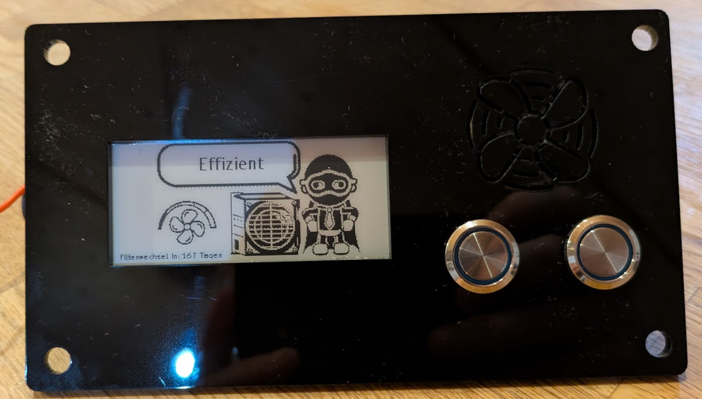
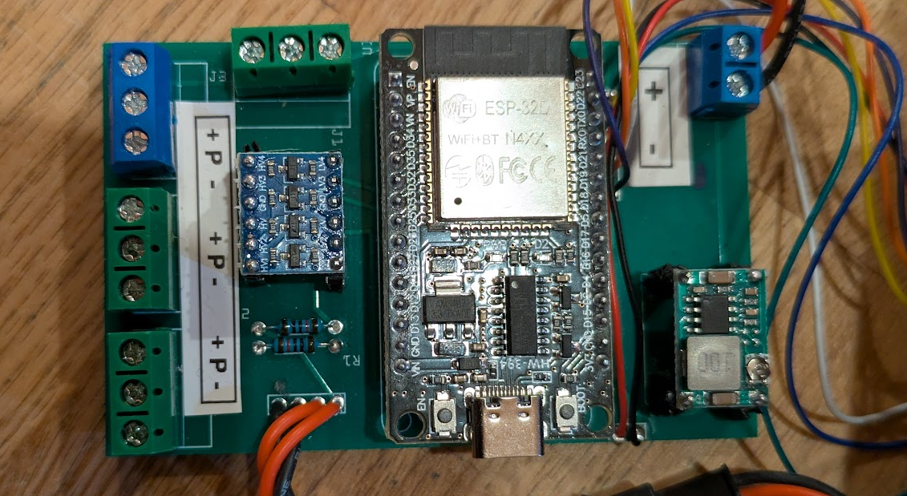

# 🌀 Decentralized Ventilation Controller

This controller operates decentralized ventilation systems (e.g. Ventomaxx) using an ESP32 and ESPHome.

  

---

## 🔧 Hardware

- PCB: `fritzing/lueftung.fzz`
- ESP32  
- 2.9" e-paper display  
- Voltage regulator  
- Level shifter  
- Misc. small components  

---

## 💾 Software

Flash the firmware using **[ESPHome](https://esphome.io/)**.

---

# ⚙️ Ventilation Programs – Functional Description

The controller provides **four programs** that manage the interaction of **four fans** depending on the desired airflow behavior.

All programs react to the selected **fan level (0–5)**, which affects:

- Fan speed (PWM ratio)
- Direction switching interval
- Overall intensity

---

## 🧠 General Control Concept

- **Number of fans:** 4  
- **Control method:** PWM (0–100%)  
- **Fan level:** `0 … 5`

### Level influence

- Defines the **PWM ratio** → `current_percentage`
- Defines the **direction change interval`

### Operation

Control via:

- Home Assistant (select + slider)
- Two hardware buttons  
  - Program  
  - Level
- E-paper display for status output

---

## 🎚️ Fan Levels

| Level | PWM Output | Switching Interval        |
|------:|-----------:|--------------------------:|
| 0     | 50 %       | almost off / static       |
| 1     | 40 %       | 70 s                      |
| 2     | 30 %       | 65 s                      |
| 3     | 20 %       | 60 s                      |
| 4     | 10 %       | 55 s                      |
| 5     | 1 %        | 50 s                      |

> The higher the level, the more **dynamic and intensive** the ventilation.

---

# 🧭 Programs

---

## ↔️ Cross Forward (`cross_1`)

**Description:**  
Opposing fan pairs run offset to generate a **directed cross-flow**.

**Logic:**

- Fans **1 & 3** → `1 − percentage`  
- Fans **2 & 4** → `percentage`

➡ Produces a constant airflow in a fixed direction.

**Typical use:**

- Continuous background ventilation  
- Gentle air exchange without direction changes  

---

## ↔️ Cross Backward (`cross_2`)

**Description:**  
Same as *Cross Forward*, but with **reversed airflow direction**.

**Logic:**

- Fans **1 & 3** → `percentage`  
- Fans **2 & 4** → `1 − percentage`

➡ Airflow is exactly opposite to `cross_1`.

**Typical use:**

- Change airflow direction  
- Prevent one-sided ventilation  

---

## 🔄 Efficient Mode (`efficient`)

**Description:**  
Alternating cross-ventilation with periodic direction change.  
**Balanced and energy-efficient.**

**Sequence:**

1. **Phase A**
   - Fans 1 & 3 → `1 − percentage`
   - Fans 2 & 4 → `percentage`
2. Wait `current_interval`
3. **Phase B**
   - Fans 1 & 3 → `percentage`
   - Fans 2 & 4 → `1 − percentage`
4. Repeat forever

➡ Ensures uniform air exchange without a permanent main airflow direction.

**Typical use:**

- Living spaces  
- Continuous operation  
- Energy-saving mode  

---

## 💨 Boost Ventilation (`intensive`)

**Description:**  
Time-controlled combination of **efficient mode** and **ventilation pause** for maximum air exchange.

**Cycle:**

1. Start **Efficient mode**
2. Run for **15 minutes**
3. Stop ventilation
4. **Pause for 105 minutes**
5. Repeat forever

➡ Simulates automatic periodic boost ventilation.

**Typical use:**

- Bathroom  
- Kitchen  
- High humidity rooms  
- Automatic fresh-air cycles  

---

# 🖥️ Display & Feedback

The e-paper display shows:

- Active program (text)
- Fan level (icons 0–5)

Additionally:

- Each fan’s current PWM output is exposed as a **percentage sensor**.

---

# 📊 Program Comparison

| Program   | Direction        | Alternating | Intensity     | Typical Use            |
|-----------|------------------|-------------|---------------|------------------------|
| cross_1   | fixed            | ❌          | low–medium    | Continuous ventilation |
| cross_2   | fixed (reversed) | ❌          | low–medium    | Airflow change         |
| efficient | alternating      | ✅          | medium        | Living spaces          |
| intensive | cyclic           | ✅          | high          | Boost ventilation      |

---

## 🔁 Behavior on Changes

Changing the **program** or **fan level**:

- Stops all running scripts
- Restarts the selected ventilation profile cleanly

---

# 🏠 Home Assistant Integration

Control elements:

- Program selection
- Fan level slider
- Fan power sensors (PWM %)

---

## 📌 Notes

- Designed for decentralized ventilation units
- Optimized for quiet, balanced, and energy-efficient operation
- each vent can be conrolled by homeassistant directly to extend the programs
